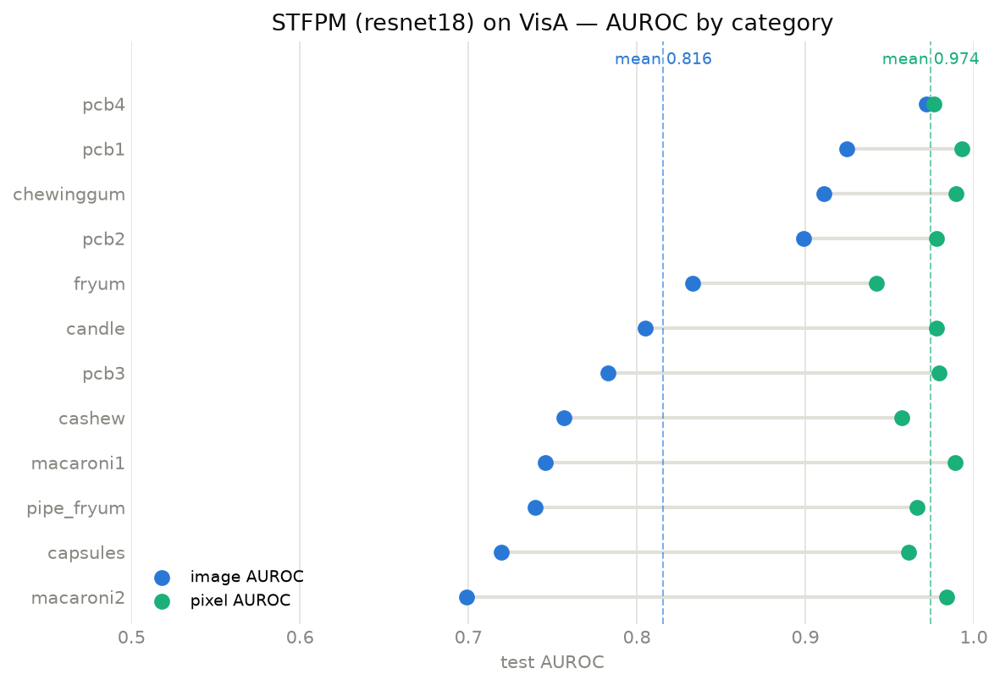
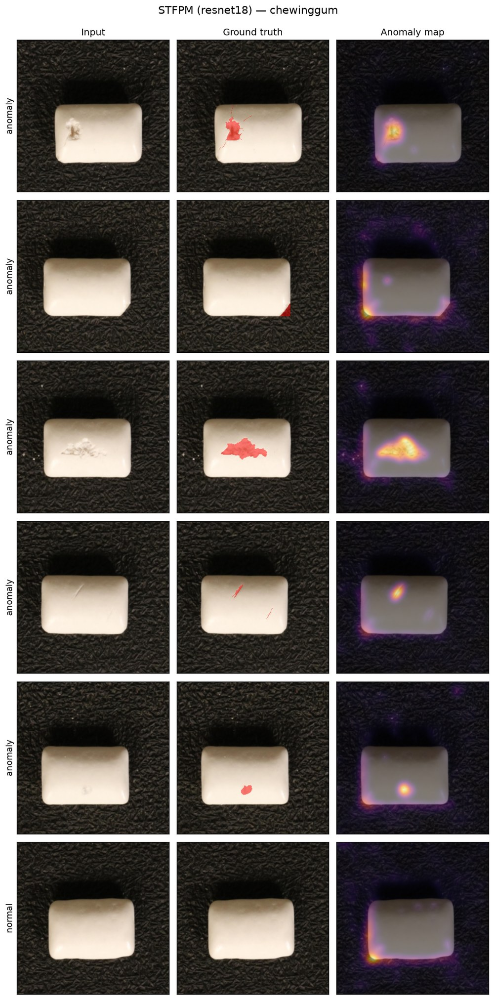
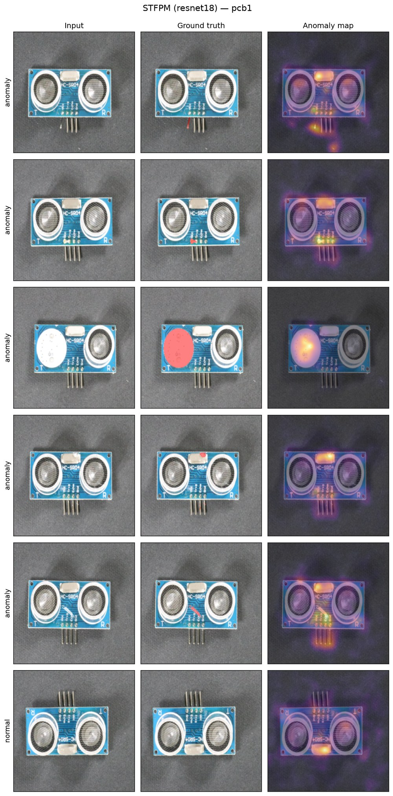

# Industrial Defect Detection with Student–Teacher Feature Matching (STFPM)

Pixel-level detection of manufacturing defects on the **VisA** benchmark, using
**Student–Teacher Feature-Pyramid Matching (STFPM)**, trained on defect-free images.



## Overview

The task: given a photo of a part, identify which pixels (if any) are defective. Defects
are rare and varied, so the approach is **anomaly detection** — model normal appearance
and flag deviations.

A frozen ImageNet backbone (the *teacher*) defines a reference feature space. A second
backbone of the same architecture (the *student*) is trained to reproduce the teacher's
features on normal images only. At test time, pixels where the student fails to match the
teacher — across several feature-pyramid levels — are scored as anomalous. Defect masks
are used for evaluation only, never for training.

## Method

- **Teacher / student:** identical backbones (default ResNet-18); the teacher is frozen
  with ImageNet weights, the student is trained from scratch.
- **Objective:** on normal images, minimise the distance between L2-normalised teacher
  and student feature maps at each pyramid level.
- **Anomaly map:** per-level teacher–student discrepancies are upsampled and multiplied,
  so a pixel scores high only where multiple scales agree — small defects surface at
  shallow levels, structural ones at deep levels.
- **Metrics:** image-level ROC AUC, pixel-level ROC AUC, and best-achievable IoU.

> Wang et al., *Student-Teacher Feature Pyramid Matching for Anomaly Detection*, BMVC 2021.

## Dataset

[**VisA (Visual Anomaly)**](https://github.com/amazon-science/spot-diff) — ~10,800 images
across 12 object categories, with normal and defective samples and pixel-level
ground-truth masks for the defects. Training uses the official one-class split
(`1cls`): **normal images only** in train, normal + anomalous in test.

> Zou et al., *SPot-the-Difference Self-Supervised Pre-training for Anomaly Detection
> and Segmentation*, ECCV 2022.

## Results

One model per category (ResNet-18 backbone, 256 px, 100 epochs), trained on normal
images only and evaluated on the official test split:

| Category   | Image AUROC | Pixel AUROC | Best IoU |
|------------|:-----------:|:-----------:|:--------:|
| candle     | 0.805 | 0.978 | 0.124 |
| capsules   | 0.720 | 0.961 | 0.167 |
| cashew     | 0.757 | 0.957 | 0.174 |
| chewinggum | 0.911 | 0.989 | 0.333 |
| fryum      | 0.833 | 0.942 | 0.202 |
| macaroni1  | 0.746 | 0.989 | 0.081 |
| macaroni2  | 0.699 | 0.984 | 0.071 |
| pcb1       | 0.925 | 0.993 | 0.454 |
| pcb2       | 0.899 | 0.978 | 0.120 |
| pcb3       | 0.783 | 0.979 | 0.186 |
| pcb4       | 0.972 | 0.976 | 0.256 |
| pipe_fryum | 0.740 | 0.967 | 0.165 |
| **mean**   | **0.816** | **0.974** | **0.194** |

A few observations:

- **Localisation is consistently strong** — pixel AUROC is 0.94–0.99 on every
  category: where the model looks is almost always the defect.
- **Image-level detection varies more.** Rigid, well-framed objects (PCBs,
  chewing gum) score highest. The weakest categories (macaroni2, capsules) have
  multiple loosely-arranged instances per image and near-invisible defects, so a
  single tiny anomaly must outweigh normal layout variation in the image score.
- **Best IoU is modest in absolute terms, as expected** — VisA defects are often
  a few dozen pixels, and the anomaly map is a smoothed heatmap rather than a
  crisp mask, which caps IoU well below what the AUROC suggests.

### Qualitative examples

Input, ground-truth defect mask, and predicted anomaly heatmap for test images
(anomalous rows plus one normal row for contrast):





Panels for all 12 categories are regenerated into `results/` by `python main.py`.

## Project structure

```text
industrial-defect-detection/
├── main.py       # entry point: download → train + evaluate every category
├── config.py     # editable run parameters (flat constants)
├── src/          # Python modules: data, model, train, evaluate, metrics, figures
├── assets/       # curated figures committed for this README
├── models/       # trained student weights (gitignored)
├── data/         # dataset cache (gitignored)
└── results/      # generated outputs (gitignored)
```

Everything runs locally, with training and inference on an NVIDIA GPU. Run the
pipeline with `python main.py`; all parameters live in `config.py`.

## Roadmap

- [x] Repository setup
- [x] Download and load the VisA dataset
- [x] Train STFPM on normal images (one category)
- [x] Evaluation (image/pixel ROC AUC, IoU)
- [x] Result figures and qualitative examples

## Tech

Python · PyTorch (CUDA) · torchvision

## License

[MIT](LICENSE)
